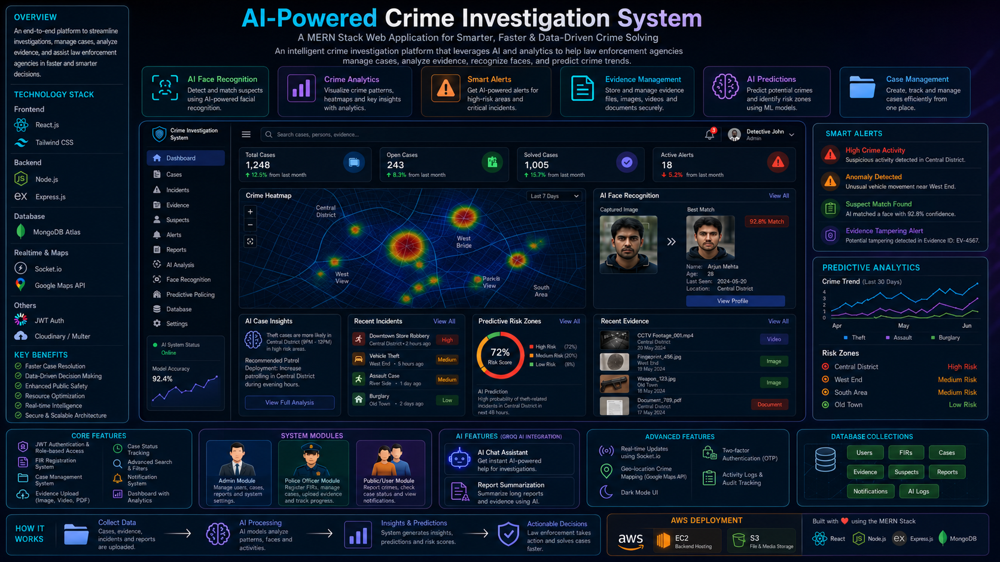

# AI-Powered Crime Investigation System



## About This Project

This project is an AI-based crime investigation system made with the MERN stack.

MERN means:

1. MongoDB for database
2. Express.js for backend API
3. React.js for frontend
4. Node.js for backend server

The project helps users, police officers, and admin users manage crime investigation work in one place. It supports complaint submission, FIR creation, case management, evidence handling, suspect tracking, reports, notifications, live chat, activity logs, Google Maps crime mapping, OTP security, and Groq AI based analysis.

This project is made for learning, college project work, and demonstration purpose.

## Main Goal

The main goal of this project is to make crime investigation work easier, faster, and more organized.

The system helps to:

1. Store crime related data safely
2. Manage complaints and FIR records
3. Track investigation cases
4. Upload and manage evidence
5. Manage suspect profiles
6. Use AI to analyze crime notes
7. Generate AI based crime reports
8. Show crime locations on Google Maps
9. Track important user actions using activity logs
10. Improve communication using chat and live updates

## User Roles

The project has three main roles.

### 1. User

A normal user can:

1. Register and login
2. Submit a complaint
3. View their complaint or case updates
4. View notifications
5. Use chat with allowed users
6. Setup two-factor authentication

### 2. Police

A police user can:

1. Create FIR records
2. Manage cases
3. Upload evidence
4. Manage suspects
5. Create investigation reports
6. Use Groq AI for crime text analysis
7. Generate AI based crime reports
8. View notifications
9. Use chat
10. Join live meetings

### 3. Admin

An admin user can:

1. Manage users
2. View and manage all main records
3. Create and close live meetings
4. View activity logs
5. Use AI features
6. Access dashboard analytics
7. Manage system level work

## Main Features

### 1. Authentication

The project has login and register features.

It uses JWT authentication. After login, the backend sends a token. The frontend stores this token and sends it with API requests.

### 2. Role Based Access

Every user has a role:

1. user
2. police
3. admin

The frontend and backend both check the role before showing or allowing important actions.

### 3. Google Login

The project supports Google login.

Google Client ID is used to verify the Google login token.

### 4. Two-Factor Authentication

The project supports OTP based two-factor authentication.

Users can setup OTP using an authenticator app like:

1. Google Authenticator
2. Microsoft Authenticator
3. Authy

After setup, the user must enter OTP during login.

### 5. Complaint System

Normal users can submit complaints.

Each complaint stores:

1. Title
2. Description
3. Location
4. Created user
5. Status
6. Assigned police officer

### 6. FIR Management

Police and admin users can create FIR records from complaints.

Each FIR stores:

1. FIR title
2. Description
3. Location
4. Status
5. Linked complaint
6. Created police/admin user
7. Status history

### 7. Case Management

Police and admin users can create and update cases.

Each case stores:

1. Case title
2. Description
3. Location
4. Latitude and longitude for map
5. Status
6. Priority
7. Assigned user
8. Related suspects
9. Related evidence
10. Status history

### 8. Evidence Management

Police and admin users can upload and manage evidence.

Evidence can include:

1. Image
2. Video
3. PDF
4. Other uploaded files

Each evidence record can be linked with a case and suspect.

### 9. Suspect Management

Police and admin users can manage suspect profiles.

Each suspect record stores:

1. Name
2. Age
3. Gender
4. Last seen location
5. Status
6. Related cases

### 10. Report Management

Users can create, view, update, and delete reports based on permission.

Reports can be linked with:

1. Case
2. FIR

### 11. AI Crime Text Analysis

Police and admin users can paste crime notes and ask Groq AI to analyze the text.

The AI can help with:

1. Case summary
2. Possible leads
3. Missing details
4. Next investigation steps

Important rule: AI should not invent facts.

### 12. AI Friendly Crime Report

Police and admin users can generate a clean crime report using AI.

The user enters raw crime notes. AI converts it into a structured report with clear sections.

The generated report can be reviewed and saved.

### 13. AI Logs

AI request history is saved in the database.

AI logs store:

1. User who used AI
2. User role
3. Input text
4. AI output
5. Status
6. Error message if failed

### 14. Notifications

The system creates notifications for important updates.

Example:

1. FIR status update
2. New evidence added
3. Case update

### 15. Real-Time Updates With Socket.io

Socket.io is used for live updates.

It supports:

1. Live chat messages
2. Live notification updates
3. Live case refresh
4. Live activity log refresh

### 16. Chat System

Users can chat based on role permission.

Example:

1. User can chat with police
2. Police can chat with user or admin
3. Admin can chat with police

### 17. Live Meeting

Admin can create live meeting rooms.

Police and admin users can join active meetings.

### 18. Crime Mapping With Google Maps

The project has a Crime Map page.

Cases with latitude and longitude are shown on Google Maps.

This helps to see crime locations visually.

### 19. Activity Logs And Audit Tracking

The project stores important user actions in activity logs.

Activity logs can show:

1. Who did the action
2. User role
3. Action type
4. Module name
5. Description
6. Date and time

Example logged actions:

1. Create case
2. Update case
3. Delete case
4. Create FIR
5. Upload evidence
6. Create report
7. Send chat message
8. Create meeting

### 20. Dashboard And Analytics

The dashboard shows useful summary data.

It can show:

1. Total FIRs
2. Total cases
3. Total evidence
4. Total suspects
5. Unread alerts
6. Status charts
7. Activity charts

### 21. Dark Mode

The project supports light mode and dark mode.

Users can switch mode from the top navbar.

## Technology Stack

### Frontend

1. React.js
2. Vite
3. Tailwind CSS
4. Axios
5. React Router
6. Socket.io Client
7. Google OAuth
8. Google Maps JavaScript API
9. Three.js for 3D logo

### Backend

1. Node.js
2. Express.js
3. MongoDB
4. Mongoose
5. JWT
6. Bcrypt
7. Multer
8. Speakeasy
9. QRCode
10. Socket.io
11. Groq AI API
12. Google Auth Library

### Database

MongoDB is used as the database.

Main collections:

1. users
2. complaints
3. firs
4. cases
5. evidences
6. suspects
7. reports
8. notifications
9. chatmessages
10. meetings
11. ailogs
12. activitylogs

## Folder Structure

```text
project-root
├── assets
│   └── project synopsis image
├── backend
│   ├── config
│   ├── controllers
│   ├── middleware
│   ├── models
│   ├── routes
│   ├── scripts
│   ├── utils
│   ├── server.js
│   └── package.json
├── frontend
│   ├── public
│   ├── src
│   │   ├── components
│   │   ├── context
│   │   ├── hooks
│   │   ├── pages
│   │   ├── services
│   │   ├── App.jsx
│   │   └── main.jsx
│   └── package.json
└── README.md
```

## Requirements

Before running the project, install these tools:

1. Node.js
2. npm
3. MongoDB or MongoDB Atlas
4. Git
5. Google Cloud account for Google login and Google Maps
6. Groq API key for AI features

## Backend Setup

Go to the backend folder:

```bash
cd backend
```

Install backend packages:

```bash
npm install
```

Create a `.env` file inside the `backend` folder.

Example:

```env
PORT=5000
MONGO_URI=your_mongodb_connection_string
JWT_SECRET=your_jwt_secret
GROQ_API_KEY=your_groq_api_key
GROQ_MODEL=llama-3.1-8b-instant
GOOGLE_CLIENT_ID=your_google_login_client_id
```

Start backend server:

```bash
npm run dev
```

Backend will run on:

```text
http://localhost:5000
```

## Frontend Setup

Go to the frontend folder:

```bash
cd frontend
```

Install frontend packages:

```bash
npm install
```

Create a `.env` file inside the `frontend` folder.

Example:

```env
VITE_GOOGLE_CLIENT_ID=your_google_login_client_id
VITE_GOOGLE_MAPS_API_KEY=your_google_maps_api_key
```

Start frontend server:

```bash
npm run dev
```

Frontend will run on:

```text
http://localhost:5173
```

## Google Maps Setup

For the Crime Map page, you need Google Maps API key.

Steps:

1. Open Google Cloud Console
2. Create a project
3. Enable Maps JavaScript API
4. Create an API key
5. Add the key in `frontend/.env`

Example:

```env
VITE_GOOGLE_MAPS_API_KEY=your_google_maps_api_key
```

For local development, restrict the key to:

```text
http://localhost:5173/*
http://127.0.0.1:5173/*
```

## Groq AI Setup

For AI analysis and AI report generation, you need a Groq API key.

Add it in `backend/.env`:

```env
GROQ_API_KEY=your_groq_api_key
GROQ_MODEL=llama-3.1-8b-instant
```

## Google Login Setup

For Google login, you need Google OAuth Client ID.

Add the same client id in both files.

Backend `.env`:

```env
GOOGLE_CLIENT_ID=your_google_login_client_id
```

Frontend `.env`:

```env
VITE_GOOGLE_CLIENT_ID=your_google_login_client_id
```

## How To Use The Project

### Step 1: Start Backend

```bash
cd backend
npm run dev
```

### Step 2: Start Frontend

Open another terminal:

```bash
cd frontend
npm run dev
```

### Step 3: Open Browser

```text
http://localhost:5173
```

### Step 4: Register Or Login

Create an account or login with an existing account.

### Step 5: Use Features Based On Role

Use the sidebar to open:

1. Dashboard
2. Create FIR
3. Evidence
4. Cases
5. Crime Map
6. Suspects
7. Reports
8. Notifications
9. Chat
10. Live Meeting
11. AI Analysis
12. AI Logs
13. Activity Logs
14. Users

Some pages are visible only for selected roles.

## Demo Data

The project has seed scripts for demo records.

### Basic Demo Data

Run:

```bash
cd backend
npm run seed:demo
```

This creates basic demo data.

### Advanced Demo Data

Run:

```bash
cd backend
npm run seed:advanced
```

This creates demo data for:

1. Crime map
2. Activity logs
3. Notifications
4. Chat
5. Cases
6. FIR
7. Evidence
8. Suspects
9. Reports
10. Meetings

## How To Check Advanced Features

### Check Real-Time Chat

1. Open the project in two browsers.
2. Login as two different users.
3. Open Chat.
4. Send a message.
5. The other user should receive the message without manual refresh.

### Check Crime Map

1. Go to Cases.
2. Create a case.
3. Add latitude and longitude.
4. Go to Crime Map.
5. The case should appear on the map.

Example coordinates:

```text
Latitude: 22.5605
Longitude: 88.3525
```

### Check Activity Logs

1. Create or update a case.
2. Upload evidence.
3. Create a report.
4. Send a chat message.
5. Go to Activity Logs.
6. You should see the action history.

### Check AI Analysis

1. Login as police or admin.
2. Go to AI Analysis.
3. Paste crime notes.
4. Click Analyze.
5. AI will return investigation help.

### Check AI Report

1. Login as police or admin.
2. Go to Reports.
3. Paste raw crime notes in ATS Friendly AI Report section.
4. Click Generate AI Report.
5. Review the generated report.
6. Save it.

### Check Two-Factor Authentication

1. Login.
2. Go to 2FA Setup.
3. Generate secret.
4. Setup authenticator app.
5. Enter OTP.
6. Enable 2FA.
7. Next login will ask for OTP.

## Important Environment Notes

Do not upload `.env` files to GitHub.

The project uses `.gitignore` to ignore:

1. backend `.env`
2. frontend `.env`
3. node_modules

Keep your API keys private.

## Useful Scripts

### Backend

```bash
npm run dev
```

Starts backend with nodemon.

```bash
npm run start
```

Starts backend normally.

```bash
npm run seed:demo
```

Creates basic demo data.

```bash
npm run seed:advanced
```

Creates advanced demo data.

### Frontend

```bash
npm run dev
```

Starts frontend development server.

```bash
npm run build
```

Builds frontend for production.

```bash
npm run serve
```

Runs Vite preview server.

## Project Purpose

This project is useful for:

1. College final year project
2. MERN stack learning
3. AI integration learning
4. Role based system learning
5. Crime investigation workflow demo
6. MongoDB database project
7. Full stack web development practice

## Future Improvements

In future, this project can be improved with:

1. Better production deployment
2. Full AWS S3 file upload
3. More advanced AI investigation assistant
4. Better map filters
5. Case timeline view
6. More detailed audit logs
7. Export reports as PDF
8. Mobile app version

## Final Note

This is an educational AI crime investigation project. It shows how MERN stack, Groq AI, Google Maps, Socket.io, JWT, OTP, and MongoDB can work together in one full stack application.

The code is written in a simple style so students can understand it, explain it in viva, and modify it later.
